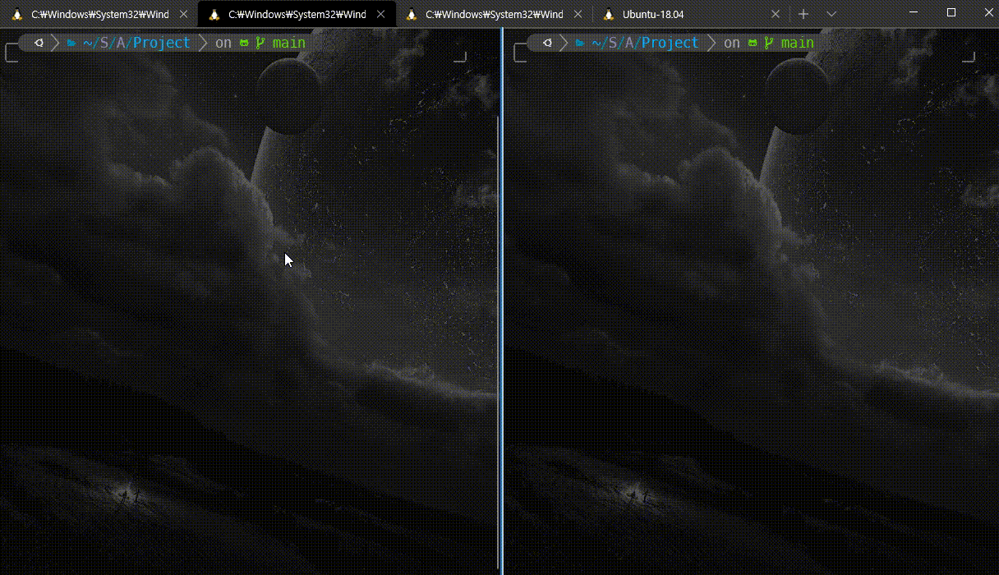

# c-cels-fahr-converter

 

### 0. Purpose
- MJU Computer Engineering System Programming class project (Fall, 2020)
- To learn UDP socket programming

### 1. Features
- Provides number-selecting console menu for client-side app
- User input validation
- Celsius-to-Fahrenheit and Fahrenheit-to-Celsius conversion
- Makefile to compile both server and client app easier

### 2. How to use
- About prerequisites
  - This app requires <b>gcc</b> and <b>make</b>.
  - For Windows user, follow these links to download prerequisites:
    - [MinGW](https://sourceforge.net/projects/mingw/)
    - [Make for Windows](http://gnuwin32.sourceforge.net/packages/make.htm)
- Usage
  1.     git clone https://github.com/13circle/c-cels-fahr-converter
  2.     make
  3. Open new terminal window and go to <b>c-cels-fahr-converter</b> directory.
  4.     ./temp_server
  5. Come back to the original terminal window.
  6.     ./temp_client
  7.  Now follow the instruction from the client app.
- Details
  - Both server and client apps terminate after client app select "Quit & Exit".
  - As user input validation is handled, any input mistakes including type mismatch are acceptable.
- Additional <b>make</b> commands
  - Remove all object files
    -     make cleanobj
  - Remove all executables
    -     make cleanexe
  - Remove all object files and executables
    -     make clean

### 3. Program Structure
- <b><u>File and Function Structure</u></b>
  - Client-side
    - temp_client.c: Client-side entry
    - clnt_utils.*: Utility functions for client (includes input validation)
      - <b>void welcome_banner()</b>
        - Show title and head descriptions
      - <b>void validate_mode_input(int *mode)</b>
        - Get mode input value and validate whether an input:
          - is entered
          - is integer
      - <b>void validate_temp_input(double *temp)</b>
        - Get temperature input value and validate whether an input:
          - is entered
          - is number
      - <b>int input_mode()</b>
        1. Show mode selection menu
        2. Get mode input (validate_mode_input)
      - <b>double input_temp(int mode)</b>
        1. Show temperature input prompt depending on the mode value
        2. Get temperature input (validate_temp_input)
  - Server-side
    - temp_server.c: Server-side entry
    - cels_vahr_conv.*: Celsius-Fahrenheit conversion functions
      - <b>void cels_to_fahr(MYSOCK *data)</b>
        - Convert data.temp to Fahrenheit
      - <b>void fahr_to_cels(MYSOCK *data)</b>
        - Convert data.temp to Celsius
  - Socket (UDP Connection)
    - mysockets.*: Both client and server socket-related functions
      - <b>MYSOCK</b>: structure for socket configurations
        - int sock: socket file descriptor
        - int clen: size of clinet sockaddr_in
        - struct sockaddr_in serv_addr: server address structure
        - struct sockaddr_in clnt_addr: client address structure
      - <b>TEMP_D</b>: struct to handle temperature data
        - int mode: conversion mode (see Main Flow for detail)
        - double temp: temperature value (Celsius & Fahrenheit)
      - <b>void temp_clnt(MYSOCK *mysock, TEMP_D *data)</b>
        1. Set socket file descriptor in mysock->sock
        2. Initialize memory space for mysock->serv_addr
        3. Configure mysock->serv_addr
           - Set IP address and port
        4. Send data to server (sendto)
        5. Set mysock->clen as size of mysock->clnt_addr
        6. Receive data from server (recvfrom)
        7. close(mysock->sock)
      - <b>void temp_serv_setup(MYSOCK *mysock)</b>
        1. Set socket file descriptor in mysock->sock
        2. Initialize memory space for mysock->serv_addr
        3. Configure mysock->serv_addr
           - Set port as same as client
           - Set address to INADDR_ANY to accept different IP addresses
        4. Bind serv_addr configurations with mysock->sock
      - <b>void temp_serv_recv(MYSOCK *mysock, TEMP_D *data)</b>
        1. Set mysock->clen as size of myscok->clnt_addr
        2. Receive data from client (recvfrom)
      - <b>void temp_serv_send(MYSOCK *mysock, TEMP_D *data)</b>
        - Send data to client (sendto)
      - <b>void temp_serv_close(MYSOCK *mysock)</b>
        - close(mysock->sock)
  - Miscellaneous
    - mylibs.h: Set of system libraries used for this app
    - Makefile: <b>make</b> configuration script
- <b><u>Main Flow</u></b>
  - In <b>temp_server.c</b>
    1. Call <b>temp_serv_setup</b> from mysockets.* to setup connection, and then call <b>temp_serv_recv</b> to wait until client-side <b>sendto</b> is called by using server-side <b>recvfrom</b>.
    2. After receiving data from the client, do different tasks depending on the mode chosen by the client. There are 3 mode menus defined as macros:
       - <b>CELS_TO_FAHR</b>: Convert Celsius to Fahrenheit.
         - Uses <b>cels_to_fahr</b> called from cels_fahr_conv.*
       - <b>FAHR_TO_CELS</b>: Convert Fahrenheit to Celsius.
         - Uses <b>fahr_to_cels</b> called from cels_fahr_conv.*
       - <b>QUIT_N_EXIT</b>: Quit and exit program.
    3. If the client choosed CELS_TO_FAHR or FAHR_TO_CELS, call <b>temp_serv_send</b> to send converted temperature data to the client.
    4. If the client choosed QUIT_N_EXIT, the server breaks out the loop and then call <b>temp_serv_close</b> after sending unconverted data to the client.
  - In <b>temp_client.c</b>
    1. Call <b>welcome_banner</b> and other utility and input validation functions from clnt_utils.* (called by following order):
       - <b>welcome_banner</b>: Show title banner messages.
       - <b>validate_mode_input</b>: Input validator for selecting correct mode.
         - Called implicitly by clnt_utils.*
       - <b>validate_temp_input</b>: Input validator for correct input temperature value.
         - Called implicitly by clnt_utils.*
       - <b>input_mode</b>: Show input prompt and return data for chosen mode menu.
       - <b>input_temp</b>: Show input prompt and return data for input temperature.
    2. For CELS_TO_FAHR and FAHR_TO_CELS, call <b>temp_clnt</b> from mysockets.* and show different format string depending on a chosen mode and a converted temperature.
    3. For QUIT_N_EXIT, send data with mode QUIT_N_EXIT and dummy temperature value (e.i. 0) to notify program exit to the server and terminate the program.

### 4. License
- No license for course project.

